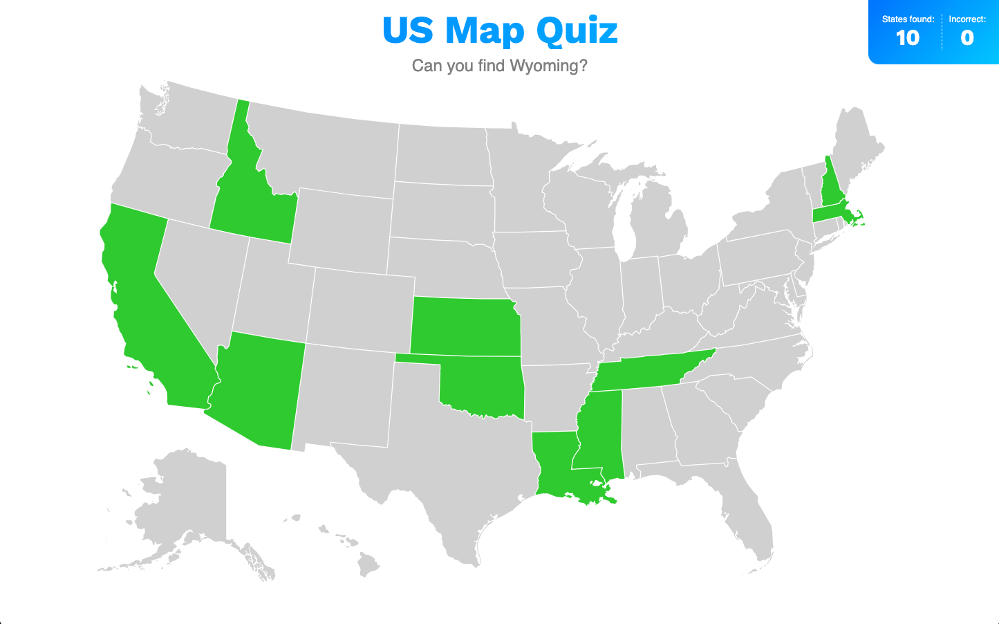

# US Map Quiz

Easy interactive game that makes learning the US states fun!  
PLAY HERE: [https://brandicameron.github.io/states/](https://brandicameron.github.io/states/)

## Screenshot

---

## Things Learned:

- How to add id's to different areas of a single svg to make them actionable
- Making an SVG based game accessible/tabbable
- Changing colors dynamically on svg's
- Adding sound effects
- How to stop a sound mid play & restart if items clicked in quick succession
- Reinforced pushing data to an array
- Reinforced using counters

---

## Author

Brandi Cameron

[hello@brandicameron.com](mailto:hello@brandicameron.com)

[www.brandicameron.com](https://brandicameron.com/)
